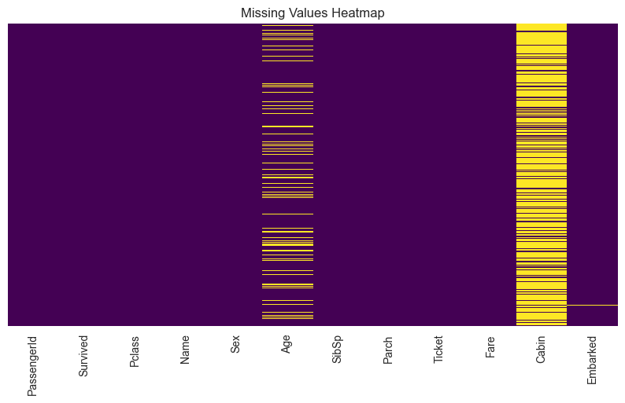
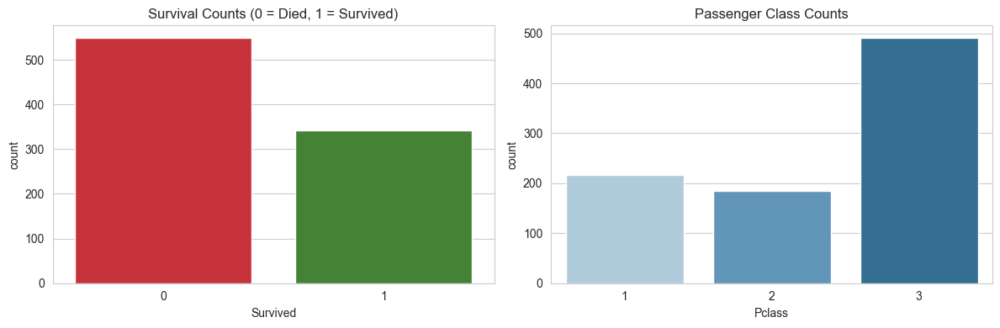
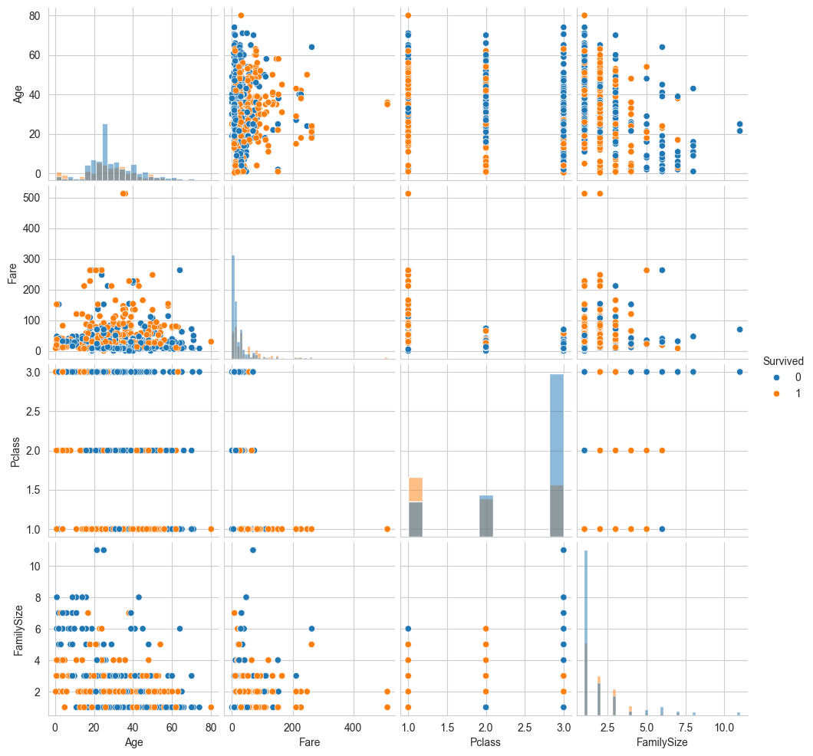

# Exploratory Data Analysis

Titanic dataset analysis and exploratory data analysis (EDA) using pandas, seaborn, and matplotlib.

The main goal is to understand the relationships between passenger features and survival outcomes. The work includes data loading, cleaning, missing value handling, feature exploration, and chart-based insights.

## Project Summary

- Loaded the Titanic training and test datasets and confirmed the shape of each.
- Inspected dataset structure, variable types, and missing value patterns.
- Cleaned data by addressing missing values in key fields such as `Age`, `Cabin`, and `Embarked`.
- Created new derived features to help explain survival, such as family size and combined categorical groupings.
- Used counts, bar plots, and distribution charts to compare survivors and non-survivors.
- Kept the notebook organized so the visuals and analysis flow in a clear, step-by-step manner.

## Analysis Details

- The dataset contains passenger demographic and ticket details, including `Pclass`, `Sex`, `Age`, `SibSp`, `Parch`, `Fare`, `Cabin`, and `Embarked`.
- The `Survived` column is the target variable, where `1` means survived and `0` means did not survive.
- Missing data was visualized and reviewed to determine the proper cleaning strategy.
- Age was especially important, since it had many missing values and is a strong predictor of survival.
- The `Cabin` field had the largest number of missing values, so it was treated carefully in the exploratory stages.
- Embarkation port analysis helped reveal where the majority of passengers boarded the ship.
- Passenger class and sex were evaluated first because they often show the strongest survival differences.
- The work also checks how family size and fare relate to survival outcomes.

## Insights

- Survival count analysis shows a noticeably smaller number of survivors than non-survivors in the dataset.
- Upper-class passengers generally had better survival proportions than lower-class passengers.
- Female passengers show a higher survival count compared to male passengers.
- Most passengers embarked from port `S`, and the distribution of port values helps explain boarding patterns.
- The visualizations provide a quick way to compare survival outcomes across multiple feature groups.
- Pairwise and joint charts make it easier to see how features such as age, fare, class, and family size interact.
- This week’s analysis is meant to be an initial EDA stage; future work can include modeling and more advanced feature engineering.

## Images

*Primary EDA chart showing relationships between age, fare, passenger class, family size, and survival.*

*Visual comparison of survival counts and passenger class distribution.*

*Pairplot showing feature distributions and their association with passenger survival.*